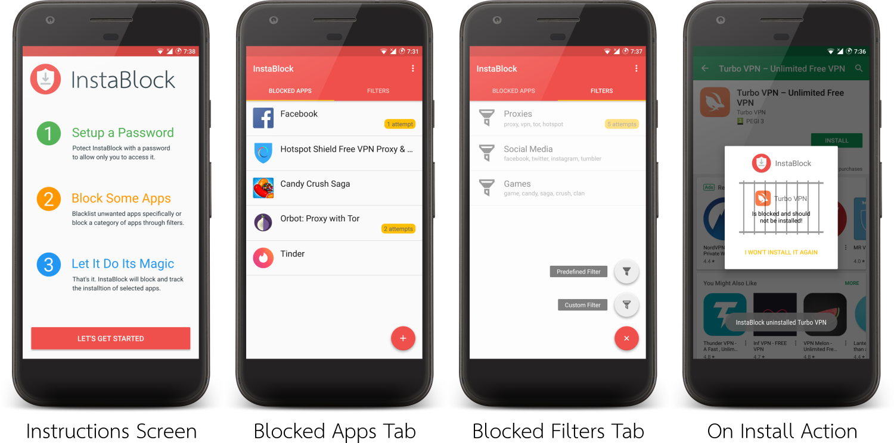

# InstaBlock

We live in a world where all kinds of mobile applications exist.
Some of them are very useful, but many others are time wasting or dangerous for kids or even adults.
This is where InstaBlock comes in, it’s an app that lets the user instantly block the installation of other applications of his choice.
The user can block a single app installed on the device or from the Play Store.
Or block a category of apps through a filter that blocks by a predefined list of keywords or a user-defined one.
InstaBlock blocks is primarily used for parental guidance as it allows parents to block apps not suitable for their children,
or for self-control as one could block apps that waste his time or reduce his productivity.

## How It Works?

Our project’s mechanism is simple, most of InstaBlock’s logic happens in a BroadcastReceiver which listens to the event of other applications’ installation (from Play Store or other sources).
When the user installs an app, InstaBlock receives that event and checks if the app name exists in the blocked apps list stored in the database.
If it’s there, it uninstalls it directly using the root privilege.
If not, it searches for any of the blocked filters’ keywords in the installed app’s name (e.g. searches for “vpn” in “Hotspot Shield - Free VPN”).
If it finds any blocked keyword, it also uninstalls the app keeping a record of which blocked filter or blocked app the user attempted to install.
The app is guarded by a password and can only be accessed through it, once the admin user logs in, they can see the list of blocked apps and filters with the count of how many attempts other users tried to install those blocked items.

## How Is It Different?

While there are many apps out there that lock other apps on the phone, none of them prevent the installation of other apps all together.
Aside from that, InstaBlock has a user-friendly GUI and it allows blocking a range of apps as well as tracking their installation attempts.

## Screenshots

## Tools Used

- [RootTools](https://github.com/Stericson/RootTools)
- [ExpandableLayout](https://github.com/cachapa/ExpandableLayout)
- [FloatingActionButton](https://github.com/futuresimple/android-floating-action-button)
- [jSoup](https://github.com/jhy/jsoup)
- [Glide](https://github.com/bumptech/glide)
